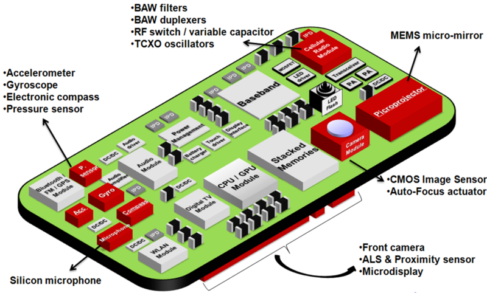

## Android Sensors Overview

Resources and Samples about Android Sensors.

This material was used as the basis for the Android Workshop, June 19th 2014, organized by the [Community of Android Developers of Almería](https://plus.google.com/u/0/communities/105420979515011141876).

The cover image is licensed under [Creative Commons](https://creativecommons.org/licenses/by/2.0/deed.es) by [Intel Free Press](https://www.flickr.com/photos/intelfreepress/7791649188/in/set-72157631088780470)

**Note:** This book has been generated using [GitBook](http://www.gitbook.io) and is open source, feel free to contribute or signal issues on [GitHub](https://github.com/josejuansanchez/android-sensors-overview). You can download a **PDF** or **ePUB** version at .